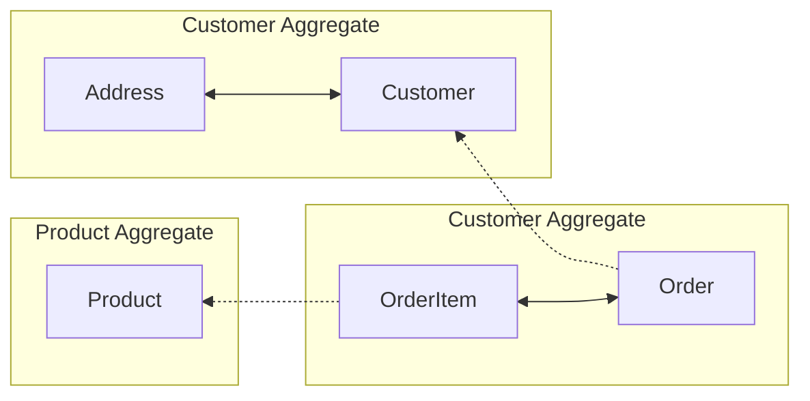

# Entidades

### Tudo que trata um comportamento de uma entidade é uma regra de negócio

Uma entidade é anêmica, ela não muda comportamentos, só reflete os atributos de uma base de dados. 

Ela não muda seu comportamento, mas sofre mudança a partir dos métodos getter e setters existentes.

Na entidade **customer** o **changeName** tem uma intenção de mudança para refletir uma necessidade de negócio. e assim existem varias modelagens de domínio rico que expressam o negócio.
```
changeName(name: string) {
  this._name = name;
  this.validate();
}
```

Com o exemplo, foi alterado o comportamento mas o estado atual da entidade nunca foi alterado, ela representa e reflete seus atributos atuais. 

### O mínimo que esperamos da entidade é que seus dados estejam consistentes
Se eu apresentar um campo **address** na minha entidade, ele deve refletir em todo meu sistema. 

### Uma entidade deve se auto-validar. 
Por exemplo, o campo **name**
da tabela customer possui uma função **validate()** para verificar se o nome está vaziu ou não. 

Por isso cuidado com os setters em uma entidade. Eles devem sempre ser validados para a entidade não ficar invalida.

## ORM - Model vs Entidade
Quando usamos um ORM nossa entidade vira um ***model***, não é focada em negócio, ela é focada em persistência. A entidade trata do negócio o model da persistência. São arquivos com coisas iguais mas contextos diferentes. 
Um atende o negócio o outro guarda dados e reflete eles para o "*mundo externo*".

## Value Objects
Os atributos de valor de um elemento devem ser classificados como um Value Object imutável, mas que pode ser trocado, não sofre necessáriamente uma alteração (Eric Evans). Trata-se de modelar os dadps de forma mais expressiva tornando mais estável porque evitamos trabalhar com tipos primitivos para tudo.

Por exemplo, o **Address** não precisa necessáriamente de um id único é apenas um conjunto de dados que representa algo para o sistema. Mas ele pode ser trocado. O endereço deixou de ser um tipo primitivo string, eagora é um objeto expressivo.
```
export default class Address {
  _street: string = "";
  _number: number = 0;
  _zip: string = "";
  _city: string = "";

  ...
}
```

Customer agora tem um endereço como um objeto e não mais um tipo primitivo. Eu garanti que o endereço vai carregar propriedades, limitando os dados e impedindo que qualquer informação seja inserida como em um tipo primitivo. Isso não tem nada a ver com banco de dados, estamos apenas mostrando uma modelagem e não persistindo o dado de endereço, até porque ele nem possui um "**id**"

```
export default class Customer {
  private _id: string;
  private _name: string = "";
  private _address!: Address;
  private _active: boolean = false;
  private _rewardPoints: number = 0;

  ...

  get Address(): Address {
    return this._address;
  }
  
  changeAddress(address: Address) {
    this._address = address;
  }

}
```

## Aggregate
É um conjunto de objetos associados que tratamos como uma unidade para propósito de mudança de negócio.

Eventualmente uma entidade está relacionada com um objeto de valor (Customer e Address). Essa cadeia define como cada parte vai conversar. Isso se chama *aggregation*.

Neste fluxo abaixo: Vemos que uma **Order** não pode existir sem **Order**, isso significa que os items são um conjunto de uma ordem de serviço. Da mesma forma que a ordem só vai existir se houver um **Customer**. Então existe uma relação entre essas duas entidades. 

Isso mostra que o **Customer** é independente de **Order** e pode existir sem ele. Por isso **Customer** não tem forte relação com **Order**, por isso o ***customerID*** fica em **Order** .

Já o **OrderItem** não faz parte da agregação do produto, mas da mesma forma **Product** também não tem forte relação com ele, por isso o ***productID*** fica em **OrderItem**.



Isso significa que os meus **roots** com seus objetos de valor são **Customer**, **Order** e **Product**, sendo estas as relações de agregração existentes.

Assim fica demonstrado que se a relação for **dentro da mesmo agregado** então a realação será pelo mesmo objeto ou classe. 
E a **relação for de agregados diferentes**, você vai ter que definir um **id** para a relação.
