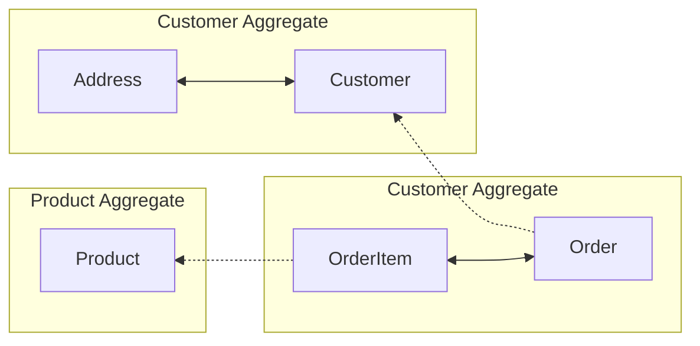

# DDD - Modelagem tática e Patterns

## Tópicos
- [Lidando com as Entidades](#hook1)
  - [Tudo que trata um comportamento de uma entidade é uma regra de negócio](#hook2)
  - [O mínimo que esperamos da entidade é que seus dadosestejam consistentes](#hook3)
  - [Uma entidade deve se auto-validar](#hook4)
- [ORM - Model vs Entidade](#hook5)
- [Value Objects](#hook6)
- [Aggregate](#hook7)
- [Domain Services](#hook8)
  - [Agregados - cuidados](#hook9)
  - [1° Exemplo](#hook10)
  - [2° Exemplo](#hook11)
  - [3° Exemplo](#hook12)
- [Repositories](#hook13)
- [Domain Events](#hook14)
  - [Componentes](#hook15)
  - [Exemplos](#hook16)
- [Modulos](#hook17)
  - [Modularizando a camada de domínio](#hook18)
- [Factories](#hook19)
  - [Exemplos](#hook20)


<a id="hook1"></a>
## Lidando com as Entidades

<a id="hook2"></a>
### Tudo que trata um comportamento de uma entidade é uma regra de negócio

Uma entidade é anêmica, ela não muda comportamentos, só reflete os atributos de uma base de dados. 

Ela não muda seu comportamento, mas sofre mudança a partir dos métodos getter e setters existentes.

Na entidade **customer** o **changeName** tem uma intenção de mudança para refletir uma necessidade de negócio. e assim existem varias modelagens de domínio rico que expressam o negócio.
```
changeName(name: string) {
  this._name = name;
  this.validate();
}
```

Com o exemplo, foi alterado o comportamento mas o estado atual da entidade nunca foi alterado, ela representa e reflete seus atributos atuais. 

<a id="hook3"></a>
### O mínimo que esperamos da entidade é que seus dados estejam consistentes
Se eu apresentar um campo **address** na minha entidade, ele deve refletir em todo meu sistema. 

<a id="hook4"></a>
### Uma entidade deve se auto-validar. 
Por exemplo, o campo **name**
da tabela customer possui uma função **validate()** para verificar se o nome está vaziu ou não. 

Por isso cuidado com os setters em uma entidade. Eles devem sempre ser validados para a entidade não ficar invalida.

<a id="hook5"></a>
## ORM - Model vs Entidade
Quando usamos um ORM nossa entidade vira um ***model***, não é focada em negócio, ela é focada em persistência. A entidade trata do negócio o model da persistência. São arquivos com coisas iguais mas contextos diferentes. 
Um atende o negócio o outro guarda dados e reflete eles para o "*mundo externo*".

<a id="hook6"></a>
## Value Objects
Os atributos de valor de um elemento devem ser classificados como um Value Object imutável, mas que pode ser trocado, não sofre necessáriamente uma alteração (Eric Evans). Trata-se de modelar os dadps de forma mais expressiva tornando mais estável porque evitamos trabalhar com tipos primitivos para tudo.

Por exemplo, o **Address** não precisa necessáriamente de um id único é apenas um conjunto de dados que representa algo para o sistema. Mas ele pode ser trocado. O endereço deixou de ser um tipo primitivo string, eagora é um objeto expressivo.
```
export default class Address {
  _street: string = "";
  _number: number = 0;
  _zip: string = "";
  _city: string = "";

  ...
}
```

Customer agora tem um endereço como um objeto e não mais um tipo primitivo. Eu garanti que o endereço vai carregar propriedades, limitando os dados e impedindo que qualquer informação seja inserida como em um tipo primitivo. Isso não tem nada a ver com banco de dados, estamos apenas mostrando uma modelagem e não persistindo o dado de endereço, até porque ele nem possui um "**id**"

```
export default class Customer {
  private _id: string;
  private _name: string = "";
  private _address!: Address;
  private _active: boolean = false;
  private _rewardPoints: number = 0;

  ...

  get Address(): Address {
    return this._address;
  }
  
  changeAddress(address: Address) {
    this._address = address;
  }

}
```

<a id="hook7"></a>
## Aggregate
É um conjunto de objetos associados que tratamos como uma unidade para propósito de mudança de negócio.

Eventualmente uma entidade está relacionada com um objeto de valor (Customer e Address). Essa cadeia define como cada parte vai conversar. Isso se chama *aggregation*.

Neste fluxo abaixo: Vemos que uma **Order** não pode existir sem **Order**, isso significa que os items são um conjunto de uma ordem de serviço. Da mesma forma que a ordem só vai existir se houver um **Customer**. Então existe uma relação entre essas duas entidades. 

Isso mostra que o **Customer** é independente de **Order** e pode existir sem ele. Por isso **Customer** não tem forte relação com **Order**, por isso o ***customerID*** fica em **Order** .

Já o **OrderItem** não faz parte da agregação do produto, mas da mesma forma **Product** também não tem forte relação com ele, por isso o ***productID*** fica em **OrderItem**.



Isso significa que os meus **roots** com seus objetos de valor são **Customer**, **Order** e **Product**, sendo estas as relações de agregração existentes.

Assim fica demonstrado que se a relação for **dentro da mesmo agregado** então a realação será pelo mesmo objeto ou classe. 
E a **relação for de agregados diferentes**, você vai ter que definir um **id** para a relação.

<a id="hook8"></a>
## Domain Services
Um serviço de domínio é uma operação sem estado que cumpre uma tarefa desse domínio. 

A indicação para criar um serviço no modelo de domínio é quando a operação que você precisa executar parece não se encaixar como um método em um Agregado ou um Objeto de Valor.

Quando um processo ou transformação significa no domínio precisa de uma operação que não é uma responsabilidade natural da **Entidade** ou **Objeto de Valor**, você pode criar um serviço de domínio. Será uma operação ao modelo, como uma interface autonoma declarada como um servico.

Defina a interface com base na linguagem desse modelo de domínio e garanta que o nome da operação faça parte da **linguágem ubiqua** e torne o serviço sem estado.

<a id="hook9"></a>
### Agregados - cuidados
- Quando a gente começa a trabalhar com Domínio a podemos acabar criando serviços anêmicos e isolados deixando tudo no *serviço de domíno* ao inves de deixar na *entidade*, o que não é legal. 

- Serviços de domíno são stateless, ou seja, não tem estado. *Nenhum dado fica armazenado no serviço de domínio* e por isso costumam ser estáticos. Justamente porque os dados devem estar nos agregados. 

- Ter o bom senso e não ser tão puritano, entenda que se você precisar criar um método no serviço de domínio para alterar uma massa de dados, não é coerente carregar uma lista em memória para alterar esses dados um a um.

<a id="hook10"></a>
### 1° Exemplo
Imagine que queremos aumentar o valor de um preço de um produto na classe ***Product*** do projeto. Lá ja existe um metodo que altera o preço chamado **changePrice()**. Mas e se desejarmos que esse preço também seja alterado em outras entidades?

Para fazer isso, o ideal é criar um *servico de domínio* chamado **product.service.ts** e ele não guarda estado nenhum apenas executar uma operação no meu produto. 
Considere aqui o puritnismo que citado acima, pois uma massa de dados está sendo alterada. Vale a pena fazer um service e rodar um único update no banco. 

<a id="hook11"></a>
### 2° Exemplo
Como pegar o total de ordens que estão sendo geradas? 
Dentro da classe **Order** existe o **totalEntity()** que calcula o valor total, mas apenas de uma Order. Para isso também foi criado um *servico de domínio* chamado **order.service.ts**. Nele temos o metodo **totalOperation()** que calcula o valor total de uma ordem.

Então temos 2 métodos que diferentes. O total da Order que vem da entidade e outro que trata de um dos comportamentos dela atraves da uma operação do *servico de domínio*.

<a id="hook12"></a>
### 3° Exemplo
Este exemplo vai demonstrar como utilizar **domain service** para trabalhar com agregados diferentes. Imagine que na Order, quando um cliente contratar um serviço ele ganhe *rewards* sobre essa ordem. 
Basicamente depende tanto da agregação de **Order** quando de **Customer**.

Para isso deve existir no **order.service.ts**. Um método chamado **placeOrder()** que recebe pontos rewards que correspondem a metade do valor total da ordem. 
Também foi criado na entidade **Customer** um método chamado **addRewardPoints()** que adiciona estes pontos, repare que ele somente adiciona o saldo. Há também o metodo *get* **rewardPoints()** que retorna os rewards.

Para operar na agregação de **Customer** a partir da **Order**, basta executar o método **placeOrder()** e capturar o retorno de **rewardPoints()**. Este exemplo se encontra no spec **order.service.spec.ts** 

```
it("should place an order and add reward points", () => {
    const customer = new Customer("c1", "Customer 1");
    const item1 = new OrderItem("i1", "Item 1", 10, "p1", 2);

    const order = OrderService.placeOrder(customer, [item1]);

    expect(customer.rewardPoints).toBe(10);
    expect(order.totalEntity()).toBe(20);
  });
```
Assim fica possível o agregado da ordem (Order) inferir nas re a regra de negocio dos reward points de cliente (Customer).

<a id="hook13"></a>
## Repositories
Se refere a um local de armazenamento para segurança e presenvação dos items para recupera-los posteriormente. E se espera que eles se encontrem no mesmo estado que estavam quando foram inseridos lá. Com a opção de poder remover ou não os items do repositório.

Todo agregado persistente terá um repositorio. De um modo geral existe uma relação um-para-um entre o agregado e o repositório.

Repare que não é uma entidade para um repositorio. Mas sim um **agregado** para um **repositório**. Por exemplo, as entidades **Order** e **OrderItem** pertencem ao agregado **Order** e haverá um repositorio **OrderRepository** para estas entidades.

O domíno não precisa saber o que tem na implementação do repositório porque devem ser desacoplados. Mas ele terá controle sobre ele e poderá alterar o repositório.

Como exemplo foi criado uma interface comum a todos os repositorios de cada agregação chamado **RepositoryInterface** em  *@shared/repository/repository-interface.ts*. 

Também foi criado um adaptador em *infrastructure* para configurar o repositório com models onde cada model vai falar com uma tabela do banco de dados. Para consumir estes models foi utilizado o **sequelize** com banco de dados **sqlite**.

Para exemplo, basta rodar os specs nos repositórios de cada agragação (order, product, customer). Onde cada repositório possui a mesma tratativa em memória apenas para os exemplos nos specs.

```	
describe("...", () => {  

  ...

  sequelize = new Sequelize({
    dialect: "sqlite",
    storage: ":memory:", //in-memory
    logging: false,
    sync: { force: true },
  });

  ...

})
```
<a id="hook14"></a>
## Domain Events

É usado para capturar um evento que aconteceu no nosso domínio.

Getters e Setters representam uma mudança de atributo e não de domínio. O evento que determina a mudança de estado do domínio. 

Um evento é o que representa uma mudança de estado no domínio. Estes objetos são processados e provocam as alterações no sistema e geram AuditLog. (Fowler, Martin. Domain Event)

- Todo evento deve ser representado em uma ação realizada no passado.
  - UserCreated
  - OrderPlaced
  - EmailSent
  - ProductCreated

- Quando utilizar Domain Events?
  - Quando queremos notificar outros bounded contexts sobre mudanças de estado;
  *Bounded Context*: delimita um modelo de domínio e suas aplicações

<a id="hook15"></a>
### Componentes

- Event: É o proprio evento que representa uma mudança, podemos guardar a hora e a data da mudança.
- Handler: Executa o processamento (uma ação) quando o evento ocorre.
- Event Dispatcher: Armazena e executa os Handlers de um evento quando ele é disparado.

A order é: 
 1 - Cria o event dispatcher
 2 - Cria o Evento
 3 - Cria o Handler para o Evento
 4 - REgistra o Evento junto com o Handler no Event Dispatcher

 Para disparar o Evento, basta executar o método "notfy" do "Event Dispatcher", assim todos os handlers do evento serão executados.

<a id="hook16"></a>
### Exemplos:
Observe a pasta *src/domain/@shared/event*.
Lá, existe a interface *EventDispatcherInterface*, ela possui todos os métodos definidos para os tipos de eventos que desejamos disparar eventos de registro e notificação.

**SendEmailWhenProductIsCreatedHandler** É a classe  que mostra o que acontece quando o evento é chamado. É o handler do produto no exemplo.

**ProductCreatedEvent** é a classe que mostra o que acontece quando um produto é criado, na mudança do estado do domínio.

**EventDispatcher**: Ela possui o método que vai registrar quando o evento ocorre.

<a id="hook17"></a>
## Módulos
Servem como containers nomeados para as classes de objetos. Deve ter baixo acoplamento entre as classes onde cada um deve ser nomeado adequadamente pois no DDD eles são anemicos ou genéricos.

- deve respeitar a linguágem universal, ubíqua;
- baixo acoplamento;
- um ou mais agregados podem estar juntos se fizer sentido;
- organizado pelo domínio e subdomínio, não pelo tipo de objetos;
- deve respeitar a mesma divisão de quando estão em camadas diferentes;

<a id="hook18"></a>
### Modularizando a camada de domínio
Fazer com que haja uma linguágem ubiqua gritando aqui. Separando domínio ou camada. Aqui cada módulo possui seu próprio repositório, factories e eventos. 

- módulo de order
- módulo de product
- módulo de customer
- módulo de repository

<a id="hook19"></a>
## Factories
Desloque a responsabilidade de criar instancias de objetos complexos e *AGREGADOS* para um objeto separado que talvez não tenha responsabilidade no modelo de domínio, mas faz parte do design de domínio. 
Fornecer uma interface para encapsular toda a criação complexa e que nao exija que o cliente faça referencia as classes concretas dos objetos complexos que estão sendo instanciados. Com *aggregates inteiros* de uma única vez, evitando variantes. (Evans, Eric. Domain-Driven Design - p. 138 - 2011)

Em resumo cria um objeto encapsulado. É importante não ferir o princípio de liskov do solid. Onde um classe filha pode ser totalmente substituída pela classe pai.

<a id="hook20"></a>
### Exemplos

Vamos supor que quero criar uma quantidade de produtos, mas para o client não importa saber qual classe vai implementar, então definimos um factory para o produto.
- src/domain/product/factory/product.factory.ts

Para isso foi criada uma interface, porque não devemos depender de implementações completas, mas de interfaces. Para isso foi criado a interface *ProductInterface* em *src/domain/product/entity*.

Para o exemplo foi criado o *product-b.ts* a diferença dele para o *product.ts* é o método price que foi alterado para multiplicar por 2:
```
get price(): number {
  return this._price * 2;
}
```

Como não quero me preocupar sobre qual produto está sendo criado (A ou B) então criamos o factory *product.factory.ts* que é responsável pela criação do produto.
Nele não é difícil perceber que se eu escolhar o produto A, executa a classe para criar o produto com preço normal e se eu escolher o produto B, vai criar um produto com o preco multiplicado por 2. Mas essa validação que faz é a factory utilizando o método **create** e extendendo a interface **ProductInterface** que encapsula essa criação. 

Para validar o exemplo basta rodar o teste unitário *product.factory.spec.ts*. 

Também foram validados factories nos módulos customer e order.
